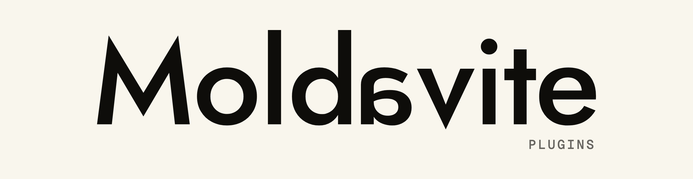

<picture>
  <source media="(prefers-color-scheme: dark)" srcset=".github/banner-dark.png">
  
</picture>

  <em>The community plugin registry.</em>

---

Plugins for [Moldavite](https://mauropereiira.github.io/Moldavite/), a
privacy-first, local-first Markdown notes app for macOS and Windows.

Moldavite reads `registry.json` from this repository (only when you open **Settings → Plugins → Browse community plugins** — never in the background) and installs plugins from the `plugins/` folder after showing you their permissions and verifying file hashes.

## Submitting a plugin

1. Read the [plugin author guide](https://mauropereiira.github.io/Moldavite/plugins.html) (API v2: commands, `notes.read`, `net.fetch` with host allowlists, Keychain `secrets`, `ui.prompt`).
2. Fork this repo and add `plugins/<your-plugin-id>/` containing `manifest.json`, `plugin.js`, and a `README.md`.
3. Add your entry to `registry.json` — including the SHA-256 of both files (`shasum -a 256 <file>`).
4. Open a PR. Review checks: manifest validates, permissions are the minimum needed, `allowedHosts` are justified, no obfuscated code.

## Security model

- Permissions are declared in the manifest and consented to per-Forge at enable time.
- Consent is pinned to a SHA-256 content hash — any code change re-prompts the user.
- Plugins run in a sandboxed Web Worker: no DOM, no filesystem, no network except host-mediated `net.fetch` to approved hosts.
- Registry installs verify the file hashes recorded in `registry.json`.

Malicious or deceptive plugins are removed and their IDs retired.
